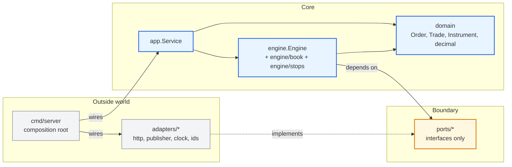
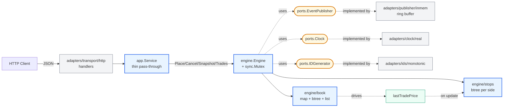

# 01 — Architecture & Module Layout

> Up: [README index](./README.md)

**Recommendation.** Hexagonal layout (ports + adapters) from day one. The matching engine is a pure Go package that depends only on `domain` and `ports` — never on a transport, a publisher, or `net/http`. Concrete implementations live in `adapters/`. A thin `app.Service` sits between transports and the engine.

**Why this is the boring choice for a production-bound engine.** The seams are where production features land — WAL, multi-pair, Kafka, gRPC, WebSocket, pre-trade risk. Putting the seams in upfront costs ~8 extra files now and saves a refactor later. The engine itself stays exactly as minimalist as the brief asks for; only its surroundings are forward-looking.

**Honest caveat against the brief.** The brief explicitly warns "do not overbuild." Hexagonal layout adds files (ports, adapters, `app.Service`) that a flat `internal/{domain,book,engine,http}` would avoid. The trade is justified only if the seams are defended in the interview walkthrough as "this is where v2 plugs in." If the reviewer treats the layout as gold-plating, the answer is to point at v1 LoC: the engine package is unchanged versus a flat layout; the cost is purely interface stubs and one composition root. If that defence does not land, collapse to flat layout — none of the matching logic moves.

---

## Repo layout

```
matching-engine/
├── go.mod
├── cmd/
│   └── server/
│       └── main.go                       # composition root: wires ports → adapters → engine
├── internal/
│   ├── domain/                           # entities + value objects, zero I/O
│   │   ├── order.go
│   │   ├── trade.go
│   │   ├── instrument.go                 # type Instrument string — "BTC/IDR" for v1
│   │   ├── enums.go                      # Side, Type, Status + JSON marshalling
│   │   └── decimal/
│   │       └── decimal.go                # alias over shopspring/decimal
│   ├── engine/                           # PURE matcher — no transport, no I/O
│   │   ├── engine.go                     # Engine.Place / Cancel / Snapshot / Trades
│   │   ├── match.go                      # the match() function (§04)
│   │   ├── book/                         # OrderBook + PriceLevel (own pkg → local invariants)
│   │   │   ├── book.go
│   │   │   ├── level.go
│   │   │   └── book_test.go
│   │   ├── stops/                        # StopBook
│   │   │   ├── stops.go
│   │   │   └── stops_test.go
│   │   └── engine_test.go                # table-driven matching tests
│   ├── ports/                            # interfaces only — engine depends on these
│   │   ├── publisher.go                  # EventPublisher: Publish(trade) / Subscribe()
│   │   ├── clock.go                      # Clock: Now() time.Time
│   │   └── ids.go                        # IDGenerator: NextOrderID(), NextTradeID()
│   ├── adapters/                         # concrete implementations of ports
│   │   ├── transport/
│   │   │   └── http/                     # POST /orders, DELETE /orders/{id}, GET /orderbook, GET /trades
│   │   │       ├── handlers.go
│   │   │       ├── dto.go
│   │   │       ├── errors.go
│   │   │       └── handlers_test.go      # required httptest integration test
│   │   ├── publisher/
│   │   │   └── inmem/                    # ring-buffer trade history (replaces engine.tradeHistory)
│   │   │       └── inmem.go
│   │   ├── clock/
│   │   │   ├── real.go                   # time.Now() wrapper for production
│   │   │   └── fake.go                   # fixed/advancing clock for tests
│   │   └── ids/
│   │       └── monotonic.go              # uint64 counter, formats "o-<n>" / "t-<n>"
│   └── app/                              # application service — transport-agnostic
│       └── service.go                    # holds *engine.Engine; future: multi-pair, risk, journal
├── docs/
│   ├── challenges/trading-engine.pdf
│   └── system_design/                    # ← this directory
└── README.md                             # how to run, decisions, future work
```

---

## Dependency direction

Read arrows as "depends on." The core (blue) never imports outward. The boundary (yellow) is interfaces only. Adapters (grey) implement the boundary and are wired in by `cmd/server`. This is what makes future production features additive — they live in the outside ring.



---

## Component view (v1)

Solid arrows are calls; dotted arrows are port → adapter implementations. Everything fits inside one Go process, behind one `sync.Mutex`.



---

## What this layout deliberately includes

- **`ports/EventPublisher`** — engine emits trades through a port instead of holding a ring buffer directly. v1 adapter is a ring buffer; v2 fans out to WebSocket / Kafka with no engine change.
- **`app.Service`** — even when it is a 5-line pass-through, the seam is what later holds multi-pair routing, idempotency, request tracing, pre-trade risk hooks.
- **Command-shaped engine API** — `Engine.Place(PlaceCommand) (PlaceResult, error)` with named struct types, not positional args. This is what makes future WAL replay trivial: serialise the command, replay produces the same result.

## What this layout deliberately leaves out

- **No `ports/journal.go` (WAL).** Adding it later is the same cost as adding it now. Skip.
- **No `ports/risk.go` (pre-trade).** Same.
- **No sequencer package.** v1's `sync.Mutex` is the sequencer; LMAX-style ring buffers come behind the same `app.Service` API later.
- **No `pkg/sdk/`.** Don't publish a public surface for an unfinished engine.
- **No empty `adapters/grpc/`, `adapters/wal/` folders.** Don't pre-create directories you haven't filled — they're noise until they have content.

---

## Rejected alternatives

| Alternative | Verdict |
|---|---|
| Flat `internal/{domain,book,stops,engine,httpapi}` | Rejected. Adding multi-pair / WAL / WS later requires moving files. The user wants production seams from day one. Reversible if the reviewer pushes back. |
| Single `engine` package with `book.go`, `stops.go` inside | Rejected. Splitting later is cheap, but per-package invariants are easier to defend in interview. |
| Pre-create empty `adapters/grpc/`, `adapters/journal/` | Rejected. Empty placeholders rot and confuse readers. Add when implemented. |
| `pkg/` for shared types | Rejected. Nothing here is intended for external import — `internal/` enforces that. |

Next: [§02 Data Structures →](./02-data-structures.md)
