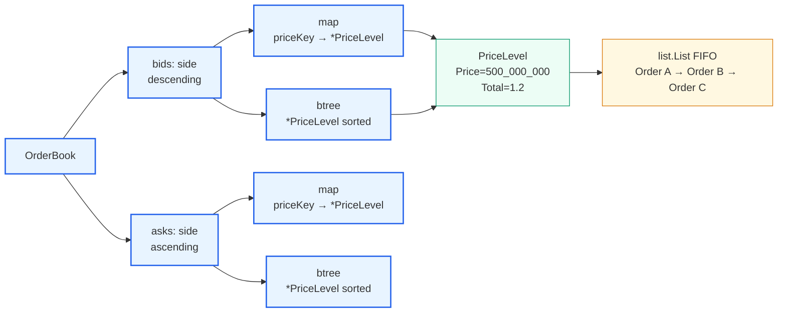

# 03 — Order Book

> Up: [README index](./README.md) | Prev: [§02 Data Structures](./02-data-structures.md) | Next: [§04 Matching Algorithm](./04-matching-algorithm.md)

**Recommendation.** Per side: `map[priceKey]*PriceLevel` for O(1) level lookup, **plus** `github.com/google/btree` for sorted price iteration. Within each level, `container/list` for FIFO. Bids order descending, asks ascending.

**Why this is the boring choice.** "Hash map for lookup, balanced tree for ordering" is the textbook order-book layout. The Google btree is one well-understood dependency. Skiplists, hand-rolled red-blacks, and pure-map-with-sort all lose on either code volume or asymptotics.

---

## Structure

The map and btree both reference the **same** `*PriceLevel`. The map gives O(1) "does a level exist at this price." The btree gives O(log n) ordered traversal — best price, top-N snapshot, in-order matching.

---

## Operations and complexity

| Operation | Complexity | Implementation |
|---|---|---|
| Best bid / best ask | O(log n) | `tree.Min()` for asks, `tree.Max()` for bids |
| Insert order at new price level | O(log n) | btree insert + map insert |
| Insert order at existing level | O(1) | map lookup + `list.PushBack` |
| Cancel order (given order ID) | O(1)* | `map[orderID]*Order` → `list.Remove(elem)` |
| Pop FIFO head at level | O(1) | `list.Front()` + `list.Remove` |
| Remove emptied level | O(log n) | btree delete + map delete |
| Snapshot top N levels | O(N) | in-order tree walk, stop at N |
| Aggregated qty per level | O(1) | `PriceLevel.Total` maintained on every mutation |

*O(log n) only when cancelling the last order at a level (level removed from the tree).

`priceKey` is `decimal.Decimal.String()` after canonicalising trailing zeros — see the canonicalisation note below.

---

## Cancel-by-ID indirection

Engine keeps `map[orderID]*Order`. Each resting `Order` has unexported `elem *list.Element` and `level *PriceLevel` back-pointers. Cancel is:

1. O(1) map lookup `orderID → *Order`
2. O(1) `list.Remove(elem)` (doubly-linked list)
3. O(1) `level.Total -= remaining_qty`
4. O(log n) **only if** the level is now empty (btree delete + map delete)

The same indirection serves the `byID` map in StopBook for armed orders — see [§05](./05-stop-orders.md).

---

## Why aggregated `Total` per level

A naive snapshot recomputes per-level total by summing every order's `RemainingQuantity`. With deep books this is O(N · level_size). By maintaining `Total` incrementally — `+=` on insert, `-=` on fill or cancel — snapshot becomes O(N) where N is the depth requested.

Invariant: `level.Total == sum(o.RemainingQuantity for o in level.Orders)`. Property-tested in [§09](./09-testing.md).

---

## Decimal map key canonicalisation

`decimal.Decimal.String()` returns `"500000000"` for `decimal.NewFromString("500000000")` and `"500000000.0"` for `decimal.NewFromString("500000000.0")` — same value, different keys. That would create two phantom price levels at the same price.

Fix: `priceKey(d) = d.Truncate(maxPrecision)` then `.String()` after `.Add(decimal.Zero)` to strip trailing zeros (or use `d.Coefficient()` + `d.Exponent()` if the lib supports it cleanly). Test the canonicalisation explicitly with paired inputs.

---

## Alternatives considered

| Alternative | Verdict |
|---|---|
| Pure map, sort on snapshot | Rejected. Snapshot becomes O(n log n). Best price requires a scan. |
| Two heaps (one per side) | Rejected. No cheap walk for top-N; cancelling an arbitrary middle order is awkward. |
| Skiplist | Reasonable. No stdlib version, more code than btree, and lock-free variants are out of scope. |
| Hand-rolled red-black tree | Rejected. Code volume eats the budget with no measurable benefit. |
| Sorted slice + binary search | Tempting for tiny books. Insert/delete shift cost is asymptotically worse and ugly. |

---

## Honest caveat: `container/list` allocates

`container/list.PushBack` allocates a new `*list.Element` on every push. At case-study scale (≤ a few thousand orders per second) this is invisible. Under sustained 100k orders/sec the GC pressure shows up in tail latency.

The HFT-grade alternative is an **intrusive doubly-linked list** — embed `prev *Order` and `next *Order` directly in `Order`, so a push is one struct write and zero heap allocations. See [§10](./10-hft-considerations.md).

For v1: keep `container/list`. It's stdlib, it's obvious, and the matcher is not the bottleneck.

Next: [§04 Matching Algorithm →](./04-matching-algorithm.md)
