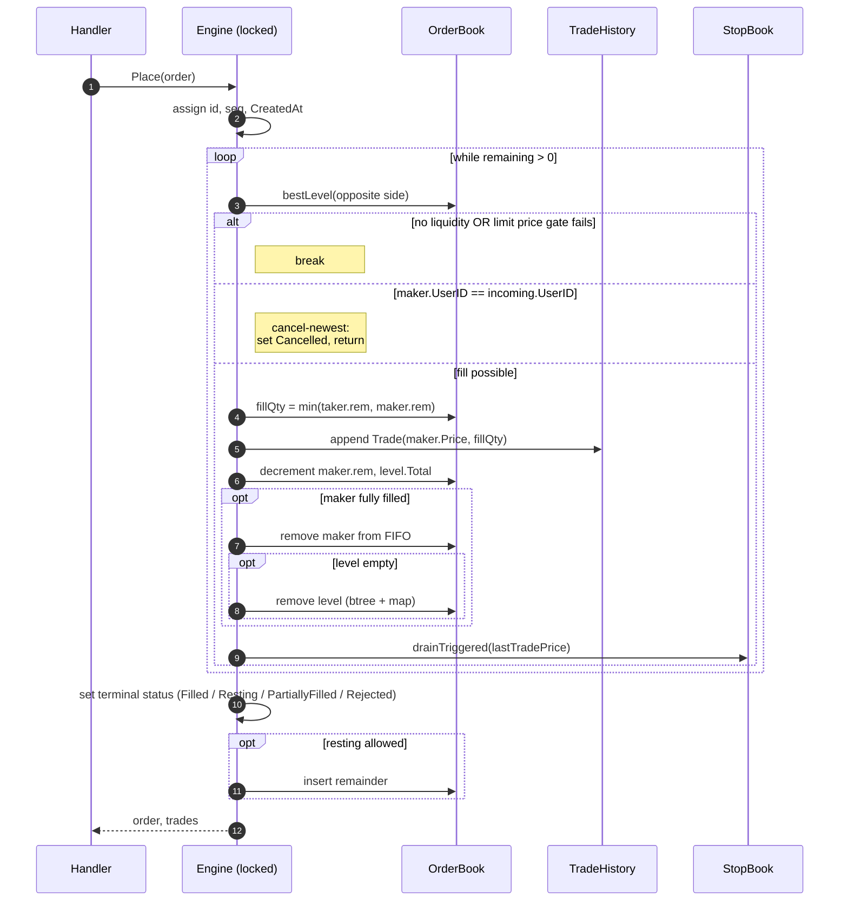
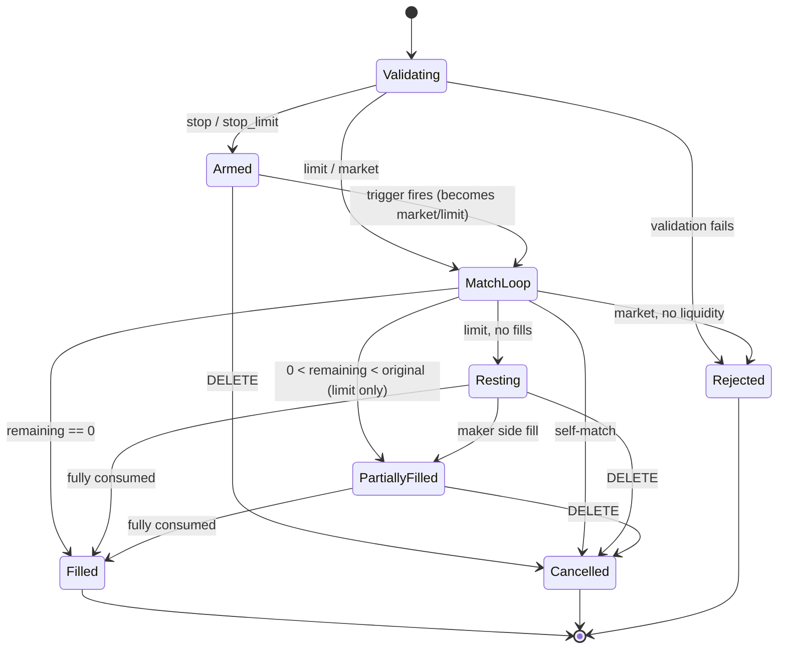

# 04 — Matching Algorithm

> Up: [README index](./README.md) | Prev: [§03 Order Book](./03-order-book.md) | Next: [§05 Stop Orders](./05-stop-orders.md)

**Recommendation.** One function: `engine.match(incoming *Order) []*Trade`, called from `Engine.Place`. It handles `Limit` and `Market` directly. `Stop` and `StopLimit` go through the StopBook (see [§05](./05-stop-orders.md)) and only call `match` after triggering, by which time their `Type` has been rewritten to `Market` or `Limit`.

**Why this is the boring choice.** A single linear function with explicit early-exits is easier to defend than a generic strategy pattern. It mirrors how every textbook describes price-time matching.

---

## The match loop at a glance



---

## Self-match policy: cancel-newest

When the next maker at the head of the FIFO queue shares `UserID` with the incoming order, set the incoming order's `Status = Cancelled`, leave whatever `RemainingQuantity` is left, and return whatever trades have been produced **so far**. The resting maker is untouched.

Three reasons to prefer this over cancel-oldest or reject:

1. **Resting liquidity is preserved.** The book stays useful to honest counterparties watching it.
2. **Idempotent under retry.** A client retrying its cancelled taker won't re-trigger the same self-match because the resting maker's state is unchanged.
3. **No mid-match book mutation.** Cancel-oldest would force us to remove a maker mid-loop and resume — extra invariant to maintain.

Edge case worth stating: if the incoming order self-matches against the very first maker, zero trades are produced and the order's terminal status is `Cancelled`. This is documented behaviour, not a bug.

---

## Pseudocode

```text
func (e *Engine) match(incoming *Order) []*Trade {
    var trades []*Trade
    opposite := book.asks if incoming.Side == Buy else book.bids

    for incoming.RemainingQuantity > 0 {
        bestLevel := opposite.bestLevel()        // Min for asks, Max for bids
        if bestLevel == nil { break }            // no liquidity

        // Limit price gate (Market skips this)
        if incoming.Type == Limit {
            if incoming.Side == Buy  && incoming.Price < bestLevel.Price { break }
            if incoming.Side == Sell && incoming.Price > bestLevel.Price { break }
        }

        maker := bestLevel.Orders.Front().Value.(*Order)

        // Self-match prevention: cancel-newest
        if maker.UserID == incoming.UserID {
            incoming.Status = Cancelled
            return trades
        }

        fillQty := min(incoming.RemainingQuantity, maker.RemainingQuantity)

        trade := &Trade{
            ID:           e.nextTradeID(),
            TakerOrderID: incoming.ID,
            MakerOrderID: maker.ID,
            Price:        maker.Price,            // maker price, not taker limit
            Quantity:     fillQty,
            TakerSide:    incoming.Side,
            CreatedAt:    e.clock.Now(),
        }
        trades = append(trades, trade)

        incoming.RemainingQuantity = incoming.RemainingQuantity - fillQty
        maker.RemainingQuantity    = maker.RemainingQuantity    - fillQty
        bestLevel.Total            = bestLevel.Total            - fillQty

        if maker.RemainingQuantity.IsZero() {
            maker.Status = Filled
            bestLevel.Orders.Remove(maker.elem)
            maker.elem, maker.level = nil, nil
            if bestLevel.Orders.Len() == 0 {
                opposite.removeLevel(bestLevel)   // O(log n)
            }
        } else {
            maker.Status = PartiallyFilled
        }

        e.tradeHistory.append(trade)
        e.updateLastTradePrice(trade.Price)       // may drain triggered stops (§05)
    }

    // Terminal status for incoming
    switch {
    case incoming.RemainingQuantity.IsZero():
        incoming.Status = Filled
    case incoming.Type == Market && len(trades) == 0:
        incoming.Status = Rejected
    case incoming.Type == Market:
        incoming.Status = PartiallyFilled         // remainder dropped, NOT rested
    case incoming.Type == Limit && len(trades) == 0:
        incoming.Status = Resting
        e.book.insert(incoming)
    case incoming.Type == Limit:                  // Limit, partially filled
        incoming.Status = PartiallyFilled
        e.book.insert(incoming)
    }

    return trades
}
```

---

## Status transition table

| Order type | Trades produced | Remaining qty | Final status | On book? |
|---|---|---|---|---|
| Limit | 0 | == original | `Resting` | yes |
| Limit | >0 | 0 | `Filled` | no |
| Limit | >0 | >0 | `PartiallyFilled` | yes |
| Market | 0 | == original | `Rejected` | no |
| Market | >0 | 0 | `Filled` | no |
| Market | >0 | >0 | `PartiallyFilled` (remainder dropped) | no |
| Self-match (any) | any | any | `Cancelled` | no |
| Stop | (after trigger, behaves as Market) | per Market row | per Market row | no |
| StopLimit | (after trigger, behaves as Limit) | per Limit row | per Limit row | maybe |

---

## State machine



---

## Trade price decision

Trade price = **maker's resting price**, not the taker's limit price. Standard exchange convention; the maker provided the liquidity at that price. Worth stating explicitly because the interviewer will probe.

Concrete example: incoming buy limit at 102, resting ask at 100. Trade prints at **100**, not 102. The taker pays the better price; the maker gets exactly what they asked for.

Next: [§05 Stop Orders →](./05-stop-orders.md)
