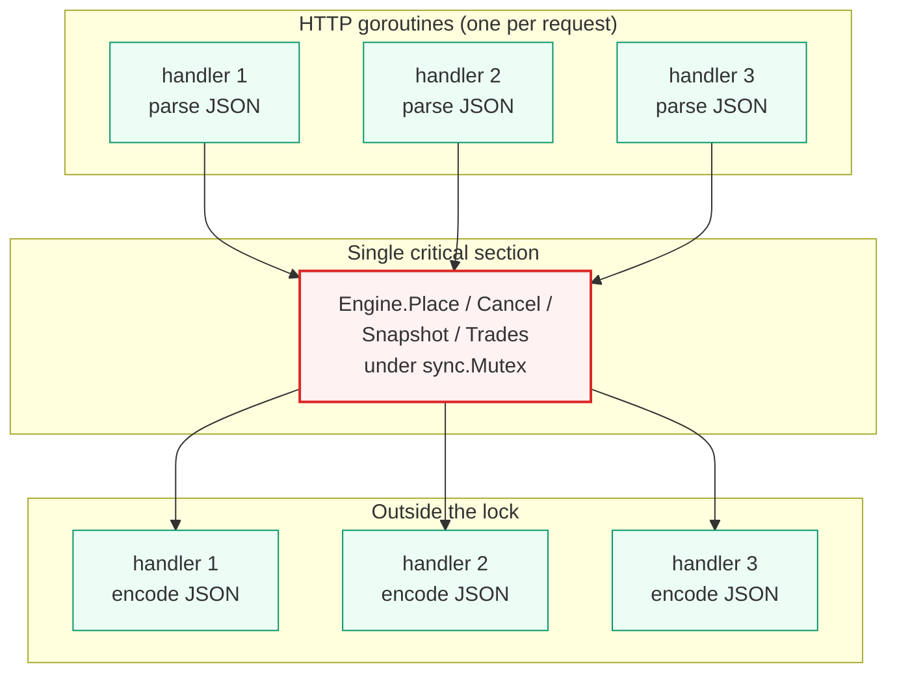

# 06 — Concurrency & Determinism

> Up: [README index](./README.md) | Prev: [§05 Stop Orders](./05-stop-orders.md) | Next: [§07 Decimal Arithmetic](./07-decimal-arithmetic.md)

These two concerns are bundled because they share the same root: a single, serialised execution model. One mutex makes concurrency simple **and** makes deterministic replay straightforward.

---

## Concurrency model

**Recommendation.** A single `sync.Mutex` on `Engine`, taken at the entry of every public method (`Place`, `Cancel`, `Snapshot`, `Trades`). HTTP handlers parse the request and encode the response **outside** the lock; the engine call itself is the only critical section.

**Why this is the boring choice.** The brief says it explicitly: "sync.Mutex beats a hand-rolled lock-free queue unless you can explain why." For a single in-memory pair, matching is microseconds; one mutex eliminates whole categories of bugs and makes the matching engine trivially deterministic.

### Lock topology

JSON parsing and encoding run in parallel on N goroutines; only the engine call serialises.

### Lock ordering — two mutexes on `Place`

`POST /orders` is the only path that takes more than one mutex. The order is fixed:

1. `app.Service.dedupMu` — guards the `(user_id, client_order_id) → PlaceResult` idempotency map.
2. `engine.mu` — guards the order book, stop book, trade history, and `lastTradePrice`.

`Cancel`, `Snapshot`, and `Trades` take only `engine.mu`. Because `dedupMu` is acquired exclusively before `engine.mu` and only on a single code path, two-mutex deadlock is structurally impossible. See [§08 Idempotency](./08-http-api.md#idempotency) for the dedup contract and [`ARCHITECT_PLAN.md` §3 invariant 16](./ARCHITECT_PLAN.md) for the test-level guarantee.

### Why not `sync.RWMutex`?

Tempting for `Snapshot` and `Trades`, but:

1. A snapshot needs a **consistent cross-side view**. A writer slipping between bid-side and ask-side reads can produce a "crossed" snapshot. RWMutex doesn't help here — the read lock has to span the entire snapshot anyway, and that's no different from a plain mutex from the writer's point of view.
2. Multiple readers contending on the same RWMutex hot-path actually slows down the writer in pathological access patterns. One mutex everywhere keeps the mental model trivial. Add RWMutex only if a benchmark shows snapshot contention.

### Why not per-side locks?

Matching constantly crosses sides: a taker buy reads asks, mutates asks, and possibly mutates bids if it rests. Per-side locks introduce two-phase locking with no parallelism gain on the hot path — and create deadlock risk when a stop cascade walks both sides.

### Why not actor / channel?

A goroutine-owned engine with reply channels serialises identically to a mutex but adds: a goroutine to manage, reply channels to thread through, shutdown choreography. Pure overhead at this scope.

### Where this breaks at scale

- **Throughput ceiling:** single-threaded matching caps somewhere in the 100k–1M ops/sec range depending on cardinality. For one pair this is fine; for an exchange across hundreds of pairs you shard by pair (each engine its own mutex).
- **Latency tail:** a deep snapshot blocks placements. Mitigated by `PriceLevel.Total` keeping snapshot O(depth requested) — see [§03](./03-order-book.md).
- **HTTP timeout under load:** a capacity problem, not a lock problem.

The graceful upgrade path — when interviewed about scale — is sharding by pair (`map[Pair]*Engine`, each with its own mutex), and only then revisiting per-side locking or sequencer-based architectures.

### Lock discipline (rules in code review)

- The engine spawns no goroutines. All matching work runs on the caller's goroutine (the HTTP handler's), serialised by the mutex.
- No callbacks. No method calls another locked method (no re-entry).
- Convention: every public method on `Engine` locks at entry and unlocks at exit (`defer`). Every unexported helper assumes the lock is held. This is documented at the top of `engine.go`.
- The `app.Service` dedup map is mutated only inside `dedupMu`. Reads outside the mutex are forbidden — even though the operation is "just a map lookup", Go races on concurrent map read/write would be undefined behaviour.
- The engine resource counters (`openOrders`, `armedStops`) are part of engine-mutex-protected state. Read and write only inside `engine.mu`. Cap-check (`if openOrders >= maxOpenOrders`) and counter-update (`openOrders++`/`--`) are part of the same critical section as the underlying book/stop-book mutation. See [§08 Resource bounds](./08-http-api.md#resource-bounds) for the contract and invariant 17 in [`ARCHITECT_PLAN.md` §3](./ARCHITECT_PLAN.md) for the equality guarantee against the actual book + stop-book contents.

---

## Determinism strategy

**Recommendation.** Close every source of nondeterminism explicitly. Monotonic seq counter, injectable `Clock`, all sorted iteration via the btree (never `range` over a map for ordered work), and matching runs single-threaded under the engine lock.

**Why this is the boring choice.** Go has exactly four common nondeterminism leaks. Plug each one and the rest follows.

### Sources and fixes

| Source | Fix |
|---|---|
| **Map iteration (randomised)** | Maps are used only for O(1) lookup. All ordered traversal goes through the btree. |
| **`time.Now()`** | `Clock` interface with `realClock` (production) and `fakeClock` (tests). Tests advance the clock between events. |
| **ID generation** | `nextOrderID` and `nextTradeID` are plain `uint64` counters; they're only called under the lock, so no atomics. |
| **FIFO tie-breaking** | When `CreatedAt` is identical (test clock returning the same instant), `Order.seq` decides. `container/list` already preserves insertion order. |
| **Goroutine scheduling** | The engine never spawns goroutines internally. All mutation runs on the caller's goroutine under the engine mutex. |

### Determinism replay test

A dedicated test submits a fixed sequence of (~50) orders against two fresh engines initialised with the same fake clock and asserts the resulting trade slice serialises to byte-identical JSON. Run it 1000× with `-count=1000`. Any reordering of trades fails.

---

## What concurrent safety actually means here

Three guarantees the engine provides:

1. **No torn state.** Every public method's full effect (orders inserted, fills computed, trades published, status updated) is atomic from any other caller's perspective.
2. **No lost trades.** A trade produced is appended to history before the engine returns, all under the same lock.
3. **No phantom orders.** A `Cancel` and a concurrent `Place` cannot interleave to produce a state where the placed order matched against an order already cancelled — both fully serialise.

Property test (see [§09](./09-testing.md)): drive 1000 random orders concurrently from N goroutines, after each batch verify invariants 1, 2, 7, 12 from the [`ARCHITECT_PLAN.md` §3](./ARCHITECT_PLAN.md). Run with `-race` to catch any accidental escape from the lock.

Next: [§07 Decimal Arithmetic →](./07-decimal-arithmetic.md)
