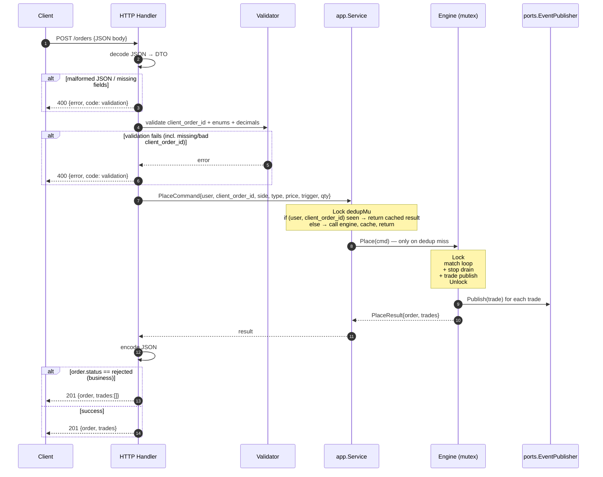

# 08 — HTTP API

> Up: [README index](./README.md) | Prev: [§07 Decimal Arithmetic](./07-decimal-arithmetic.md) | Next: [§09 Testing](./09-testing.md)

**Recommendation.** Stdlib `net/http` with `http.ServeMux`. Go 1.22+ pattern routing supports `DELETE /orders/{id}` natively, so no router framework. Handlers translate JSON ↔ engine calls and shape responses.

**Why this is the boring choice.** Bringing in chi/gin saves nothing at this scope. The HTTP layer is genuinely thin.

---

## Endpoints

Matching the brief exactly:

| Method | Path | Body | Returns |
|---|---|---|---|
| POST | `/orders` | `{user_id, client_order_id, side, type, price?, trigger_price?, quantity}` | `{order, trades}` — see PDF example |
| DELETE | `/orders/{id}` | none | `{order}` (terminal status `cancelled`) or 404 |
| GET | `/orderbook?depth=N` | none | `{bids: [{price, quantity}, …], asks: [{price, quantity}, …]}` (top N levels per side; armed stops excluded) |
| GET | `/trades?limit=N` | none | `{trades: [...]}` |

`user_id` is a request body field; callers are trusted (per brief). `client_order_id` is required for `POST /orders` — see [Idempotency](#idempotency) below.

---

## HTTP request lifecycle



Note: JSON decoding happens **before** the engine lock. Encoding happens **after**. The lock-held window is just the engine call.

---

## DTOs

```go
type PlaceOrderRequest struct {
    UserID        string `json:"user_id"`
    ClientOrderID string `json:"client_order_id"` // REQUIRED — 1..64 ASCII printable chars
    Side          string `json:"side"`
    Type          string `json:"type"`
    Price         string `json:"price,omitempty"`
    TriggerPrice  string `json:"trigger_price,omitempty"`
    Quantity      string `json:"quantity"`
}

type PlaceOrderResponse struct {
    Order  OrderDTO   `json:"order"`
    Trades []TradeDTO `json:"trades"`
}

type ErrorResponse struct {
    Error string `json:"error"`
    Code  string `json:"code"` // "validation" | "not_found" | "conflict"
}
```

`OrderDTO` and `TradeDTO` mirror the brief's example field names exactly. Decimal fields are JSON strings, not numbers — preserves precision across the wire. `OrderDTO` echoes `client_order_id` so the caller can correlate without storing the engine-side mapping.

Note: `ClientOrderID` deliberately has no `omitempty` tag — it must serialise as `""` if absent, so validation step 0 can reject the request with a clear error.

---

## Error model

| HTTP | When |
|---|---|
| 201 | New order placed (POST `/orders`), even if `status: rejected` in the body |
| 200 | Successful GET / DELETE |
| 400 | Malformed JSON, missing fields, non-numeric decimals, unknown enum values, qty ≤ 0, **value exceeds upper bound (`quantity`, `price`, `trigger_price`, `user_id` length, `client_order_id` length)** |
| 404 | DELETE on unknown order ID |
| 409 | DELETE on already-terminal order (filled / cancelled / rejected) |
| **413** | Request body exceeds 64 KB (caught by `http.MaxBytesReader` middleware before the handler) |
| **429** | Engine cap exhausted (`too_many_orders` or `too_many_stops`). Caller should back off and retry — same `client_order_id` may be reused (cap errors are not cached) |
| 500 | Engine panic (recover middleware logs it and returns generic error) |

**Key decision.** Business-rejected placements (trigger already satisfied; market with no liquidity) return **201** with `status: rejected` in the body. They're not HTTP errors; the placement was accepted and processed, the outcome is just no trade. This is worth stating clearly because the interviewer will probe.

Validation errors (malformed JSON, qty ≤ 0) are HTTP 400 because the request itself was wrong.

---

## Validation pipeline

0a. **`client_order_id` precondition** (only for `POST /orders`). Must be present, length 1..64, ASCII printable (`0x20`–`0x7E`). Specific failure messages:
   - missing or `""` → 400 `validation`, `"client_order_id is required"`
   - length > 64 → 400 `validation`, `"client_order_id must be 1..64 chars"`
   - non-printable byte → 400 `validation`, `"client_order_id must be ASCII printable"`

0b. **`user_id` precondition** (only for `POST /orders`). Must be present, length 1..128, ASCII printable. Brief says callers are trusted — that justifies skipping authentication, **not** skipping length validation. Failure → 400 `validation`, `"user_id must be 1..128 ASCII printable chars"`.

0c. **Body size precondition** (HTTP middleware, applied before the handler runs). Body length ≤ 64 KB via `http.MaxBytesReader`. Exceeds → 413 `request_too_large`, `"request body exceeds 65536 bytes"`.

1. Decode JSON. Error → 400 `validation`.
2. Parse decimals. Error → 400 `validation`.
3. Validate enums (`side ∈ {buy, sell}`, `type ∈ {limit, market, stop, stop_limit}`).
4. Validate type-specific fields:
   - `limit`: `price > 0`.
   - `market`: `price` and `trigger_price` absent.
   - `stop`: `trigger_price > 0`, `price` absent.
   - `stop_limit`: `price > 0`, `trigger_price > 0`.
5. **Numeric upper bounds**: `quantity > 0` AND `quantity ≤ 10¹⁵`; `price ≤ 10¹⁵` (when present); `trigger_price ≤ 10¹⁵` (when present). Failures:
   - `quantity` too large → 400 `validation`, `"quantity exceeds maximum 1000000000000000"`
   - `price` too large → 400 `validation`, `"price exceeds maximum 1000000000000000"`
   - `trigger_price` too large → 400 `validation`, `"trigger_price exceeds maximum 1000000000000000"`
6. Hand to `app.Service` (which performs idempotency dedup before invoking the engine). Engine may further reject on cap exhaustion — see [Resource bounds](#resource-bounds).

---

## Idempotency

**Required `client_order_id` field on `POST /orders`.** The client supplies a unique-per-order string (1..64 ASCII printable chars); the server deduplicates retries by `(user_id, client_order_id)` so a retried POST returns the cached result instead of creating a second order.

### Why required, not optional

A trading API's worst bug is a double-fill. Optional safety is no safety in practice — a client that forgets to send the field is still vulnerable to the exact failure idempotency exists to prevent. We diverge from the brief's example payload (which omits the field) deliberately, mirroring the FIX protocol where `ClOrdID` is mandatory. The [README index](./README.md) and [§11](./11-production-evolution.md) reflect this as a v1 commitment, not a future enhancement.

### How it works

- Storage lives in `app.Service`, **not** the engine. The engine is oblivious to `client_order_id`.
- Map: `map[string]engine.PlaceResult` keyed by `userID + "\x00" + clientOrderID`. The `\x00` separator is collision-proof because the validation rule forbids non-printable bytes.
- A dedicated `sync.Mutex` (separate from the engine mutex) guards the map and is taken **before** the engine mutex on `Place`. Only `Place` takes both — no other path takes either, so no deadlock risk.

### Behaviour matrix

| Scenario | Result |
|---|---|
| `client_order_id` missing / empty | HTTP 400 `validation`. Engine **not** called. |
| `client_order_id` > 64 chars or non-printable | HTTP 400 `validation`. Engine **not** called. |
| Valid key, never seen | Engine runs. Result cached. HTTP 201. |
| Valid key, seen, **same** body | Cached `PlaceResult` returned. Engine **not** called again. HTTP 201, byte-identical body. |
| Valid key, seen, **different** body (e.g. different price) | Cached result returned anyway. The `client_order_id` is the source of truth. (Stripe-style 422 on body mismatch is v2.) |
| Engine returns error | **Not cached.** Client may retry safely. |
| Engine returns business-rejected (`status: rejected`) | **Cached.** Same retry returns same rejection. |
| Two concurrent requests, same key, key not yet seen | Second blocks on the dedup mutex; sees cached result when first completes. Engine called exactly once. |

### What's not in v1 (deferred to [§11](./11-production-evolution.md))

- TTL or LRU eviction (map grows for the process lifetime — fine at case-study scope)
- Persistence of dedup state across restart (restart wipes, consistent with §15 of [`ARCHITECT_PLAN.md`](./ARCHITECT_PLAN.md) open decisions)
- Body-hash validation rejecting key reuse with different parameters
- Per-user rate limiting on `client_order_id` submission

This contract is enforced by invariant 16 in [`ARCHITECT_PLAN.md` §3](./ARCHITECT_PLAN.md).

---

## Resource bounds

The brief says "callers are trusted" — that justifies skipping authentication and per-user fairness, but **does not** justify trusting arbitrary input sizes. Even a well-intentioned client with a serialisation bug can crash the server with `quantity: "9".repeat(10^7)`. v1 therefore enforces:

### Per-request limits (validated at the HTTP boundary)

| Field | Limit | Failure |
|---|---|---|
| `quantity` | `0 < q ≤ 10¹⁵` | 400 `validation` |
| `price` (when present) | `0 < p ≤ 10¹⁵` | 400 `validation` |
| `trigger_price` (when present) | `0 < t ≤ 10¹⁵` | 400 `validation` |
| `user_id` length | 1..128 ASCII printable chars | 400 `validation` |
| `client_order_id` length | 1..64 ASCII printable chars (see [Idempotency](#idempotency)) | 400 `validation` |
| HTTP request body | ≤ 64 KB | **413** `request_too_large` |

The numeric ceiling of 10¹⁵ is set generously — far above any realistic trade size (Bitcoin total supply is 2.1×10⁷). Restrictive limits cause more false rejections than they prevent real harm at v1 scope. Production v2 ratchets these down with usage data.

### Engine-wide caps (validated inside `engine.Place`)

Engine carries two `int` counters protected by the engine mutex:

| Field | Cap | Sentinel | HTTP |
|---|---|---|---|
| `openOrders` | 1,000,000 | `engine.ErrTooManyOrders` | **429** `too_many_orders` |
| `armedStops` | 100,000 | `engine.ErrTooManyStops` | **429** `too_many_stops` |

Counters are mutated only on lifecycle transitions:

- `openOrders++` when an order **rests** in the book (post-match, `RemainingQuantity > 0`, type=limit). A market order or fully-filled limit order does **not** consume a slot.
- `openOrders--` on cancel or final fill.
- `armedStops++` when a stop / stop-limit arms (not immediately rejected by trigger-already-satisfied check).
- `armedStops--` on stop trigger or cancel.

Engine mutex serialises all four sites — no separate counter lock is needed. See [§06](./06-concurrency-and-determinism.md) lock discipline rules. Counter accuracy is enforced by invariant 17 in [`ARCHITECT_PLAN.md` §3](./ARCHITECT_PLAN.md).

### Why engine-wide and not per-user

Per-user fairness requires `map[user_id]int` plus engine API surface for `OrderCount(userID)`. For a single-tenant case study with the brief's "trusted callers" assumption, the cost is unjustified. Engine-wide cap is **two int counters** and **four ±1 sites**.

The defendable interview answer: *"I bounded engine-wide because the brief assumes trusted callers — fairness becomes load-bearing only when callers are adversarial. Per-user fairness lands in v2 with rate limiting and pre-trade risk."*

### Cap error retry semantics

A cap-exhaustion error is **not** stored in the idempotency dedup map. The same `client_order_id` may be retried later when capacity frees. This is consistent with the dedup rule "do not cache errors" — failed first attempts have no observable engine state, so retries cannot violate idempotency. A `Retry-After` header is **not** sent in v1 because cap is binary, not time-windowed; v2 with backpressure metrics can supply an estimate.

### What's not in v1 (deferred to [§11](./11-production-evolution.md))

- Per-user open-orders cap with `X-RateLimit-*` headers
- Token-bucket rate limiting on requests per second
- Adaptive backpressure / `Retry-After` hinting
- Configurable caps via flags or hot-reload
- Cap-utilisation metrics

---

## Concurrency at the HTTP layer

`http.Server` uses goroutine-per-request. All requests funnel through the engine's single mutex (see [§06](./06-concurrency-and-determinism.md)). Handlers do not start fire-and-forget goroutines after writing the response.

---

## Graceful shutdown

`cmd/server/main.go` listens on SIGINT / SIGTERM and calls `http.Server.Shutdown` with a context timeout. There's no engine state to flush (in-memory only).

```go
ctx, stop := signal.NotifyContext(context.Background(), os.Interrupt, syscall.SIGTERM)
defer stop()

go func() { _ = srv.ListenAndServe() }()
<-ctx.Done()

shutdownCtx, cancel := context.WithTimeout(context.Background(), 5*time.Second)
defer cancel()
_ = srv.Shutdown(shutdownCtx)
```

---

## Example payloads

### POST /orders — limit buy

Request:
```json
{
  "user_id": "u-123",
  "client_order_id": "buy-btc-2026-04-20-001",
  "side": "buy",
  "type": "limit",
  "price": "500000000",
  "quantity": "0.5"
}
```

Response (HTTP 201):
```json
{
  "order": {
    "id": "o-abc",
    "user_id": "u-123",
    "client_order_id": "buy-btc-2026-04-20-001",
    "side": "buy",
    "type": "limit",
    "price": "500000000",
    "quantity": "0.5",
    "remaining_quantity": "0.2",
    "status": "partially_filled",
    "created_at": "2026-04-20T10:00:00Z"
  },
  "trades": [
    {
      "id": "t-1",
      "taker_order_id": "o-abc",
      "maker_order_id": "o-xyz",
      "price": "499500000",
      "quantity": "0.3",
      "taker_side": "buy",
      "created_at": "2026-04-20T10:00:00Z"
    }
  ]
}
```

### POST /orders — market with no liquidity (business reject)

Request:
```json
{
  "user_id": "u-123",
  "client_order_id": "market-buy-2026-04-20-002",
  "side": "buy",
  "type": "market",
  "quantity": "0.5"
}
```

Response (HTTP 201, **not** 4xx):
```json
{
  "order": {
    "id": "o-def",
    "client_order_id": "market-buy-2026-04-20-002",
    "status": "rejected",
    "...": "..."
  },
  "trades": []
}
```

### POST /orders — duplicate `client_order_id` (idempotent retry)

Resubmitting the first request (same `(user_id, client_order_id)`, identical body) returns **byte-identical** response without re-invoking the engine. `o-abc` is *not* duplicated; `t-1` is *not* re-emitted; `GET /trades` still shows one trade.

The same response is returned even if the new request body differs (e.g. different price) — the `client_order_id` is the source of truth. See the [Idempotency](#idempotency) behaviour matrix.

### POST /orders — missing `client_order_id` (validation reject)

Request:
```json
{
  "user_id": "u-123",
  "side": "buy",
  "type": "limit",
  "price": "500000000",
  "quantity": "0.5"
}
```

Response (HTTP 400):
```json
{
  "error": "client_order_id is required",
  "code": "validation"
}
```

### POST /orders — body too large (resource bound)

Any POST whose body exceeds 64 KB is rejected by middleware **before** reaching the handler. JSON is not decoded, so `client_order_id` is never extracted (the request leaves no idempotency dedup record).

Response (HTTP 413):
```json
{
  "error": "request body exceeds 65536 bytes",
  "code": "request_too_large"
}
```

### POST /orders — engine cap exhausted (resource bound)

When the engine has 1,000,000 resting orders (or 100,000 armed stops), new placements that would consume a slot are rejected. Caller should back off — the same `client_order_id` may be retried later (cap errors are **not** cached).

Response (HTTP 429):
```json
{
  "error": "open orders cap reached",
  "code": "too_many_orders"
}
```

### GET /orderbook?depth=5

```json
{
  "bids": [
    {"price": "500000000", "quantity": "1.5"},
    {"price": "499500000", "quantity": "0.7"}
  ],
  "asks": [
    {"price": "501000000", "quantity": "0.3"}
  ]
}
```

Armed stops are not visible here — see [§05](./05-stop-orders.md).

Next: [§09 Testing →](./09-testing.md)
