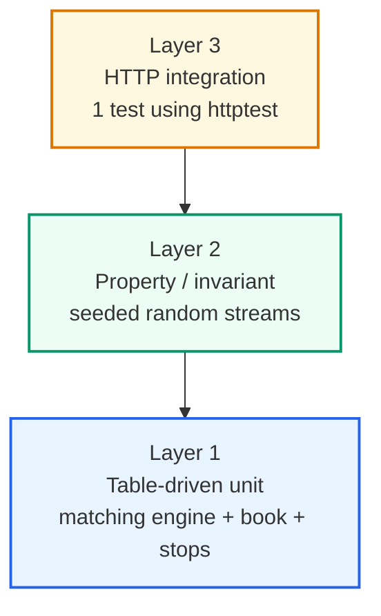

# 09 — Testing Strategy

> Up: [README index](./README.md) | Prev: [§08 HTTP API](./08-http-api.md) | Next: [§10 If This Were Really HFT](./10-hft-considerations.md)

**Recommendation.** Three layers, all using stdlib `testing`. No `testify`.

1. **Table-driven matching tests** in `internal/engine` — golden trade sequences.
2. **Property / invariant tests** — sum-of-fills ≤ original qty, book never crossed, deterministic replay.
3. **One HTTP integration test** in `internal/adapters/transport/http` using `net/http/httptest`.

**Why this is the boring choice.** Standard Go testing pyramid. Stdlib is enough; `testify` is just sugar.

The brief is explicit: "Write tests first for the matching engine. It is the one piece where correctness is non-negotiable."

---

## Test pyramid



Layer 1 establishes correctness on hand-picked cases. Layer 2 catches the cases you didn't think of. Layer 3 ensures the wire format works end-to-end.

---

## Layer 1 — table-driven matching unit tests

```go
type matchTC struct {
    name       string
    setup      []orderSpec      // orders placed before the test order
    incoming   orderSpec
    wantTrades []tradeSpec      // exact, in order
    wantStatus domain.Status
    wantBook   []levelSpec      // optional: expected book state after
}
```

Golden cases that must be present:

- Empty book + market → `Rejected`
- Empty book + limit → rests; status `Resting`
- Limit crosses one level → single trade, `Filled`
- Limit crosses multiple levels → multi-trade, `Filled`
- Limit partially crosses → trade(s) + remainder rests as `PartiallyFilled`
- Market eats book partially → `PartiallyFilled`, remainder dropped
- FIFO within level: two makers at the same price; taker partial fill matches the first maker first
- Self-match: incoming buy from the same user as a resting ask → `Cancelled`, possibly with prior trades against other makers
- Self-match in middle: taker fills one external maker, hits own resting next → trade for the external maker, `Cancelled` for the taker
- Cancel resting limit → `Cancelled`, removed from book
- Cancel non-existent → error
- Stop buy with `trigger > lastTradePrice` → `Armed`
- Stop buy with `trigger ≤ lastTradePrice` at placement → `Rejected`
- Stop fires when last trade reaches trigger → produces market trades
- Stop cascade: one stop fires, its trade fires another → both fire deterministically by `seq`
- StopLimit fires → becomes `Limit`, rests if it doesn't immediately match

---

## Layer 2 — property / invariant tests

Generate seeded random valid order streams (bounded sizes) and assert after each operation:

| Invariant | Why |
|---|---|
| `0 < trade.qty ≤ min(taker.original_qty, maker.original_qty)` | Conservation of quantity |
| Sum of trade quantities for any order ≤ its original quantity | Sum-of-fills bound |
| `bestBid().Price < bestAsk().Price` whenever both exist | Book never crossed |
| For each level: `level.Total == sum(remaining_qty of orders in level)` | `Total` consistency |
| Replay determinism: same seed → byte-identical trade JSON | Deterministic replay |
| No trade has `taker.UserID == maker.UserID` | Cancel-newest STP works |
| Armed stop never appears in `Snapshot()` output | Stop / book separation |

`testing/quick` or a hand-rolled seeded generator works; full property frameworks (`gopter`) are overkill.

The full invariant list lives in [`ARCHITECT_PLAN.md` §3](./ARCHITECT_PLAN.md).

---

## Layer 3 — HTTP integration test

```go
func TestHTTP_PlaceLimitAndSnapshot(t *testing.T) {
    eng := engine.New(engine.Deps{Clock: fakeClock(), IDs: monotonicIDs(), Pub: inmemPub()})
    svc := app.NewService(eng)
    srv := httptest.NewServer(http.NewMux(svc))
    defer srv.Close()

    // POST /orders limit buy 0.5 @ 500000000
    // POST /orders limit sell 0.3 @ 499500000  (crosses)
    // GET  /trades   → expect one trade
    // GET  /orderbook → expect bid 0.2 @ 500000000, no asks
}
```

One test satisfies the brief's "at least one integration test against the HTTP API." Add happy-path tests for each endpoint as time permits.

---

## Test fixtures

`internal/engine/testdata/` for any large golden JSON trade sequences. Standard `flag.Bool("update", ...)` pattern for regenerating goldens:

```bash
go test ./internal/engine/... -update
```

---

## Race detector

Run the property test with `-race` to catch any accidental escape from the engine lock:

```bash
go test ./... -race -count=10
```

The deterministic replay test runs with `-count=1000`:

```bash
go test ./internal/engine/ -run TestDeterministicReplay -count=1000
```

Both are part of the pre-submission self-check in [`ARCHITECT_PLAN.md` §10](./ARCHITECT_PLAN.md).

Next: [§10 If This Were Really HFT →](./10-hft-considerations.md)
