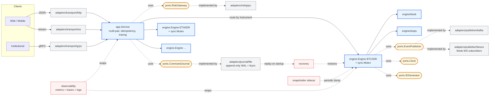

# 11 — Production Evolution

> Up: [README index](./README.md) | Prev: [§10 If This Were Really HFT](./10-hft-considerations.md)

This section is **post-interview material**, not v1 scope. It is here to defend the hexagonal layout in the design walkthrough — "yes the seams cost ~8 files; here is what they buy when production-X arrives" — and to give the user a punchlist for the extension exercise.

The core claim: the matching engine itself does not change going from v1 to v2. The match loop, the book and stop-book data structures, the single-mutex concurrency model, the decimal arithmetic, and the determinism guarantees are all production-grade as written. What changes is the **outside** of the hexagon: more transports, real persistence, fan-out publishing, multi-pair routing, pre-trade risk, observability.

---

## v1 vs v2 at a glance

| Layer | v1 (challenge) | v2 (production) |
|---|---|---|
| Transport | HTTP only | HTTP + gRPC + WebSocket + (optionally) FIX |
| Persistence | None — in-memory | WAL writes before matching; periodic snapshots; replay on startup |
| Publisher | In-memory ring buffer | Kafka / NATS for durable events; in-mem fan-out for WS subscribers |
| Routing | Single engine | `app.Service` holds `map[Instrument]*engine.Engine` |
| Idempotency | Required `client_order_id`, in-memory map, no TTL, wiped on restart | Same field + persisted dedup map (replays from WAL), TTL/LRU eviction, body-hash check rejecting key-collision with mismatched body |
| Resource bounds | Per-field input limits + engine-wide caps (`openOrders ≤ 10⁶`, `armedStops ≤ 10⁵`); 413 on body > 64 KB; 429 on cap exhaustion | Per-user fairness via `map[user_id]int`, token-bucket rate limiting, adaptive backpressure with `Retry-After`, configurable caps via flags or hot-reload, cap-utilisation metrics |
| Risk | None (excluded by brief) | Pre-trade gateway invoked by `app.Service` before engine |
| Sequencer | The engine mutex is the sequencer | Optional: dedicated sequencer with WAL fsync, single-threaded worker |
| Observability | Standard log | Prometheus metrics, OpenTelemetry traces, structured logs |
| Recovery | Restart loses state | Snapshot load + WAL replay on startup |
| **Engine itself** | Pure Go, single mutex, btree+list+map | **Unchanged** — same package, same code |

---

## v2 component layout

Same legend as the v1 diagrams: blue = core, yellow = port, grey = adapter, green = state, red = sidecar.

What hasn't moved: `engine.Engine`, `engine/book`, `engine/stops`, the `EventPublisher` / `Clock` / `IDGenerator` ports. Every new box is in the outer ring or a sidecar.

---

## Diff per production concern

Each row is the smallest set of changes to add that capability. "New" means a new file or package. "Edit" means an edit to an existing file from v1. The engine package is never edited (with two named exceptions).

| Concern | Changes | Engine touched? |
|---|---|---|
| **Multi-pair** | Edit `app.Service` to hold `map[Instrument]*engine.Engine`; edit each transport DTO to carry `instrument`. | No |
| **WebSocket trade feed** | New `adapters/transport/ws/`; new `adapters/publisher/fanout/` that wraps the in-mem publisher and broadcasts to subscribers. Wire in `cmd/server`. | No |
| **gRPC transport** | New `adapters/transport/grpc/` calling `app.Service`. Wire in `cmd/server`. | No |
| **Kafka publisher** | New `adapters/publisher/kafka/` implementing `ports.EventPublisher`. Swap (or compose with) the in-mem one in `cmd/server`. | No |
| **WAL + recovery** | New `ports/journal.go`; new `adapters/journal/file/`; edit `app.Service` to call `journal.Append(cmd)` before `engine.Place(cmd)`; new `cmd/server` startup hook to replay journal into the engine. | No (engine already has command-shaped API) |
| **Snapshots** | Engine grows `Snapshot()` and `Restore(snapshot)` methods; new `cmd/snapshotter/`; new `adapters/snapshot/file/`. | Yes — additive methods only, no change to match logic |
| **Pre-trade risk** | New `ports/risk.go`; new `adapters/risk/grpc/`; edit `app.Service` to call risk before `engine.Place`. | No |
| **Metrics & tracing** | New `internal/observability/`; wrap each port with a metrics decorator in `cmd/server`. | No |
| **HA / replication** | New `cmd/replicator/`; the WAL becomes the replication source-of-truth; secondary engines apply the same command stream. | No |
| **Sequencer (LMAX-style)** | New `internal/sequencer/` between `app.Service` and `engine`. Engine still receives commands one at a time. | No |
| **Fees** | Edit `engine/match.go` to compute fee per trade and attach it to the `Trade` struct. | Yes — single function edit |
| **New order types (IOC/FOK/iceberg)** | Edit `domain/enums.go` for the new `Type`; edit `engine/match.go` for the new branch. | Yes — additive branch |

---

## v2 punchlist (compact, for the design probe)

When the interviewer asks "what would you do next with more time" — these eight bullets, in this order:

1. **WAL + replay.** `ports.CommandJournal`; `app.Service` calls `Append(cmd)` before `engine.Place(cmd)`; recovery replays journal on startup. Engine's command-shaped API already supports this.
2. **Multi-pair routing.** `app.Service` holds `map[Instrument]*engine.Engine`; transport DTOs gain `instrument`; each engine keeps its own mutex.
3. **Kafka publisher.** New `adapters/publisher/kafka/` implementing `ports.EventPublisher`. Compose with in-mem fan-out.
4. **WebSocket fan-out.** New `adapters/transport/ws/` subscribing to the same publisher port. Engine untouched.
5. **Pre-trade risk.** `ports.RiskGateway`; `app.Service` calls before `engine.Place`. Position limits, fat-finger, kill-switch.
6. **Observability.** Prometheus histograms (HdrHistogram preferred for tails), OpenTelemetry traces wrapping `app.Service` and ports — never on the matching hot path.
7. **Snapshot/restore.** Engine grows additive `Snapshot()` / `Restore(snapshot)` methods for fast restart without full WAL replay.
8. **Sharding by pair → sequencer at scale.** When single-mutex throughput becomes the bottleneck (≥ 100k orders/sec/pair), introduce LMAX-style sequencer in front of the engine. Same engine code.
9. **Idempotency hardening.** v1 already enforces required `client_order_id` and in-memory dedup (see [§08 Idempotency](./08-http-api.md#idempotency)). v2 adds: (a) persistence of the dedup map via WAL replay so retries survive restart, (b) TTL/LRU eviction to bound memory, (c) body-hash validation rejecting key reuse with mismatched parameters (Stripe-style 422), (d) per-user rate limiting on `client_order_id` submission.
10. **Per-user resource limits + backpressure.** v1 already enforces engine-wide caps and per-field input bounds (see [§08 Resource bounds](./08-http-api.md#resource-bounds)). v2 adds: (a) per-user open-orders / armed-stops cap via `map[user_id]int` returning 429 with `X-RateLimit-Remaining`/`X-RateLimit-Reset` headers, (b) token-bucket rate limiting on requests per second, (c) adaptive backpressure publishing `Retry-After` based on cap-utilisation metrics, (d) configurable caps via flags / env / hot-reload, (e) per-instrument caps `map[Instrument]EngineCaps` once multi-pair lands.

Anything beyond these is a separate conversation: matching-core in C++/Rust, kernel-bypass NICs, FPGA tick-to-trade — covered in [§10](./10-hft-considerations.md), not here.

---

## What this buys, restated

The architecture pays back at the moment somebody asks "can we add X?" In v1 the answer for every X is "yes, here's the seam." That conversation is the entire point of the design walkthrough in the interview, and the same answer holds when production-X actually arrives.
