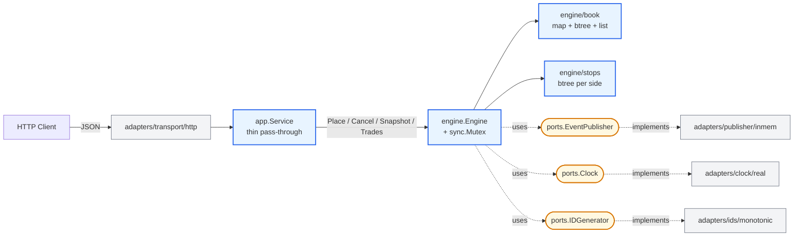

# Matching Engine — System Design

A single-pair, in-memory matching engine in Go for **BTC/IDR**. Limit / market / stop / stop-limit orders, FIFO price-time priority, exposed via a small REST API.

The brief lives at [`docs/challenges/trading-engine.pdf`](../challenges/trading-engine.pdf). The objective: solve those challenges with a minimalist v1, but keep the design **extensible** so production features (multi-pair, WAL, Kafka, WebSocket, pre-trade risk) drop in without rewriting the matching core.

This file is the **index**. Each design topic lives in its own file so you can read one decision at a time. The architect's working plan — invariants, risks, phase-by-phase execution — is in [`ARCHITECT_PLAN.md`](./ARCHITECT_PLAN.md).

---

## Reading order

If you have 5 minutes — read [§01 Architecture](./01-architecture.md) and [§04 Matching Algorithm](./04-matching-algorithm.md). That is the shape and the heart.

If you have 20 minutes — read in this order:

| # | Topic | Why it matters |
|---|---|---|
| [01](./01-architecture.md) | **Architecture & module layout** | Hexagonal seams, dependency direction, what stays in v1 vs. v2 hooks |
| [02](./02-data-structures.md) | **Domain types** | `Order`, `Trade`, enums, ID format — the wire shape |
| [03](./03-order-book.md) | **Order book** | Map + btree + list, complexity table, alternatives |
| [04](./04-matching-algorithm.md) | **Matching algorithm** | The match loop, self-match policy, status state machine |
| [05](./05-stop-orders.md) | **Stop orders & cascade** | StopBook structure, trigger semantics, cascade termination proof |
| [06](./06-concurrency-and-determinism.md) | **Concurrency & determinism** | Single `sync.Mutex`, lock discipline, deterministic replay |
| [07](./07-decimal-arithmetic.md) | **Decimal arithmetic** | `shopspring/decimal`, honest take on integer minor units |
| [08](./08-http-api.md) | **HTTP API** | Endpoints, DTOs, error model, validation pipeline |
| [09](./09-testing.md) | **Testing strategy** | Three layers — unit, property, integration |
| [10](./10-hft-considerations.md) | **If this were really HFT** | What changes (lock-free, integer prices, NUMA) and why none of it applies here |
| [11](./11-production-evolution.md) | **Production evolution** | v1 → v2 punchlist with a component diagram |

---

## What's in scope

Single trading pair (BTC/IDR). Single Go process. In-memory state. HTTP API.

## What's out of scope

Mirrors the brief verbatim:

- Persistence, recovery, replication
- Authentication, rate limiting, balances, KYC
- Multiple pairs (single pair only — extension is documented in [§11](./11-production-evolution.md))
- WebSocket, Kafka, gRPC, FIX
- IOC / FOK / iceberg / post-only / trailing-stop
- Fees, fee schedules
- Admin / operational endpoints

If you find yourself drafting one of these, stop. They are deliberate non-goals for v1 and tracked in [§11](./11-production-evolution.md) as v2 punchlist items.

Idempotency is **in scope** for v1 — `POST /orders` requires a `client_order_id` field for replay-safe retries. See [§08 Idempotency](./08-http-api.md#idempotency).

DoS prevention via input bounds and engine-wide caps is **in scope** for v1 — per-field upper limits, 64 KB body cap, 1M open-orders cap, 100k armed-stops cap. Per-user fairness is deferred to v2. See [§08 Resource bounds](./08-http-api.md#resource-bounds).

---

## Decision summary

The single screen the interviewer or reviewer should be able to recall:

| Decision | Choice | Defended in |
|---|---|---|
| Module layout | Hexagonal (ports + adapters) | [§01](./01-architecture.md) |
| Order book | `map[priceKey]*PriceLevel` + `btree[*PriceLevel]` + `list.List` per level | [§03](./03-order-book.md) |
| Stop book | Twin btrees (asc buy, desc sell) + `byID map` | [§05](./05-stop-orders.md) |
| Self-match policy | **Cancel-newest** | [§04](./04-matching-algorithm.md) |
| Trade price | Maker resting price | [§04](./04-matching-algorithm.md) |
| Trigger satisfied at placement | **Reject** | [§05](./05-stop-orders.md) |
| Stop cascade ordering | Deterministic by placement `seq` | [§05](./05-stop-orders.md) |
| Concurrency | Single `sync.Mutex` on `Engine` | [§06](./06-concurrency-and-determinism.md) |
| Decimal | `github.com/shopspring/decimal` | [§07](./07-decimal-arithmetic.md) |
| HTTP status for business-rejected order | **201** with `status: rejected` in body | [§08](./08-http-api.md) |
| Idempotency | **Required `client_order_id`** body field; deduped at `app.Service`, in-memory, wiped on restart | [§08](./08-http-api.md) |
| Resource bounds | Per-field input limits (`quantity`/`price` ≤ 10¹⁵, `user_id` ≤ 128 chars, body ≤ 64 KB) + engine-wide caps (`openOrders` ≤ 10⁶, `armedStops` ≤ 10⁵). Per-user fairness deferred to v2 | [§08](./08-http-api.md#resource-bounds) |
| Trade history | Bounded ring buffer, last 10,000 trades | [§02](./02-data-structures.md) |

Every "why" sits in the linked file. Every "what could go wrong" sits in [`ARCHITECT_PLAN.md` §4](./ARCHITECT_PLAN.md).

---

## How this design stays extensible

Those are reconciled by:

1. **Hexagonal layout from day one.** ~8 extra files of pure interface stubs. The matching engine never imports a transport, a publisher, or `net/http`. Everything that arrives in v2 lands in `adapters/`, not in `engine/`. See [§01](./01-architecture.md).
2. **Command-shaped engine API.** `Engine.Place(PlaceCommand) (PlaceResult, error)` with named struct types. Future WAL replay just serialises the command. See [§01](./01-architecture.md).
3. **Ports for `Clock`, `IDGenerator`, `EventPublisher`.** v1 adapters are trivial. v2 swaps them for monotonic-fsync clocks, snowflake IDs, Kafka publishers — engine untouched. See [§01](./01-architecture.md).
4. **No premature implementation of v2 hooks.** No empty `adapters/grpc/`, no `ports.RiskGateway` until risk is being built. The seam exists; the implementation does not. See [§11](./11-production-evolution.md).

The cost: ~8 files. The benefit: the answer to every "can we add X?" probe is "yes, here is the seam."

---

## Quick architecture glance

Blue = core (never imports outward). Yellow = ports (interfaces only). Grey = adapters (swappable implementations).

For the full v1 diagram and the v2 evolution see [§01](./01-architecture.md) and [§11](./11-production-evolution.md).
