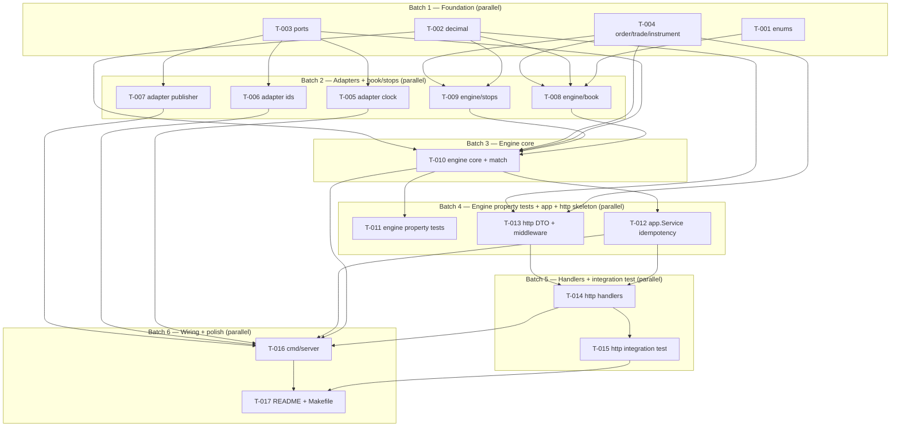

# Tasks — Matching Engine v1

Execution-ready ticket index. The system design is finalised in [`docs/system_design/`](../system_design/README.md). This directory breaks the implementation into 17 disjoint tickets that can be picked up cold by an agent or human, with explicit batch boundaries that allow parallel execution.

## Mission

Implement the v1 matching engine specified in [`docs/system_design/`](../system_design/README.md) by executing the tickets below. Each ticket touches a disjoint set of files and cites the design sections it implements. No design decisions are owned by ticket execution — every "what" and "why" is already pinned in the design docs. If an executor hits a question not answered there, surface it as an `OPEN QUESTION` rather than deciding it locally.

## Dependency DAG

## Ticket table

| ID | Title | Batch | Est (h) | Blocks | Blocked by | Touches |
|---|---|---|---|---|---|---|
| [T-001](./T-001-domain-enums.md) | domain enums + JSON | B1 | 0.75 | T-008,T-010,T-013 | none | `internal/domain/enums.go`, `internal/domain/enums_test.go` |
| [T-002](./T-002-domain-decimal.md) | decimal wrapper | B1 | 0.5 | T-008,T-009,T-010,T-013 | none | `internal/domain/decimal/decimal.go` |
| [T-003](./T-003-ports.md) | port interfaces | B1 | 0.5 | T-005,T-006,T-007,T-010 | none | `internal/ports/clock.go`, `internal/ports/ids.go`, `internal/ports/publisher.go` |
| [T-004](./T-004-domain-order-trade.md) | Order/Trade/Instrument | B1 | 0.75 | T-008,T-009,T-010,T-013 | none | `internal/domain/order.go`, `internal/domain/trade.go`, `internal/domain/instrument.go` |
| [T-005](./T-005-adapter-clock.md) | clock adapter (real+fake) | B2 | 0.5 | T-016 | T-003 | `internal/adapters/clock/real.go`, `internal/adapters/clock/fake.go`, `internal/adapters/clock/clock_test.go` |
| [T-006](./T-006-adapter-ids.md) | monotonic ID adapter | B2 | 0.5 | T-016 | T-003 | `internal/adapters/ids/monotonic.go`, `internal/adapters/ids/monotonic_test.go` |
| [T-007](./T-007-adapter-publisher-inmem.md) | inmem publisher | B2 | 0.75 | T-016 | T-003 | `internal/adapters/publisher/inmem/inmem.go`, `internal/adapters/publisher/inmem/inmem_test.go` |
| [T-008](./T-008-engine-book.md) | OrderBook + PriceLevel | B2 | 1.5 | T-010 | T-001,T-002,T-004 | `internal/engine/book/book.go`, `internal/engine/book/level.go`, `internal/engine/book/book_test.go` |
| [T-009](./T-009-engine-stops.md) | StopBook + cascade primitives | B2 | 1.0 | T-010 | T-002,T-004 | `internal/engine/stops/stops.go`, `internal/engine/stops/stops_test.go` |
| [T-010](./T-010-engine-core.md) | Engine + match + cascade + errors | B3 | 1.5 | T-011,T-012,T-016 | T-001,T-002,T-003,T-004,T-008,T-009 | `internal/engine/engine.go`, `internal/engine/match.go`, `internal/engine/errors.go`, `internal/engine/engine_test.go` |
| [T-011](./T-011-engine-property-tests.md) | property + replay tests | B4 | 1.0 | T-017 | T-010 | `internal/engine/engine_property_test.go`, `internal/engine/replay_test.go` |
| [T-012](./T-012-app-service-idempotency.md) | app.Service + dedup | B4 | 1.0 | T-014,T-016 | T-010 | `internal/app/service.go`, `internal/app/service_test.go` |
| [T-013](./T-013-http-dto-middleware.md) | HTTP DTOs + body-limit middleware | B4 | 0.75 | T-014 | T-002,T-004 | `internal/adapters/transport/http/dto.go`, `internal/adapters/transport/http/errors.go`, `internal/adapters/transport/http/middleware.go` |
| [T-014](./T-014-http-handlers.md) | HTTP handlers + validation | B5 | 1.25 | T-015,T-016 | T-012,T-013 | `internal/adapters/transport/http/handlers.go`, `internal/adapters/transport/http/router.go` |
| [T-015](./T-015-http-integration-test.md) | HTTP integration test | B5 | 1.0 | T-017 | T-014 | `internal/adapters/transport/http/handlers_test.go` |
| [T-016](./T-016-cmd-server.md) | composition root | B6 | 0.5 | T-017 | T-010,T-012,T-014,T-005,T-006,T-007 | `cmd/server/main.go` |
| [T-017](./T-017-readme-makefile.md) | top-level README + Makefile | B6 | 0.5 | none | T-015,T-016 | `README.md`, `Makefile` |

Total estimate: **13.25 h**. Architect plan (§5) budget is 8 h plus 0.5 h slack; the ticket sum is conservative because each ticket includes the full DoD checklist (vet, race, doc-link verification). Real wall time depends on parallelism — see batch fan-out below.

## Critical path

T-002 → T-008 → T-010 → T-014 → T-015 → T-017. Six serial steps; estimated ≈ 6.0 h on the critical chain. Anything off this chain is parallel slack.

## Execution model

Each batch is a barrier. Within a batch every ticket has a disjoint `Touches files` list, so multiple agents can work simultaneously without merge conflict. Between batches you must wait for all tickets in the previous batch to close before starting the next — downstream tickets reference upstream APIs.

### Recommended workflow

1. Spawn N agents (1 per ticket) for **Batch 1**. They write the foundation types in parallel.
2. When all four B1 tickets close, run `go build ./...` to verify the foundation compiles.
3. Spawn 5 agents for **Batch 2**. They build adapters and the book/stops packages.
4. Run `go test ./internal/...` after B2 to verify book and stops tests are green.
5. Single ticket for **Batch 3** (T-010 is too tightly coupled internally to split).
6. Spawn 3 agents for **Batch 4** (T-011, T-012, T-013 in parallel).
7. Spawn 2 agents for **Batch 5** (T-014 and T-015 in parallel — T-015 only reads the public router/handler API).
8. Spawn 2 agents for **Batch 6** (T-016 wires everything; T-017 writes top-level README — they touch unrelated files).
9. Final `go test ./... -race -count=10` and `go vet ./...` before declaring done.

### Parallelism caveats

- T-014 and T-015 are scheduled in the same batch only because T-015 touches `handlers_test.go` (test file) while T-014 touches the production handler files. The integration-test author must assume the public router and DTO contract from T-013; if that contract changes mid-batch, T-015 reruns its assertions.
- Within B2, T-008 and T-009 are independent. T-005, T-006, T-007 each implement one port and do not interact.
- Within B4, T-011 reads only the `engine` public API delivered by T-010. T-012 also reads only that API. T-013 builds DTOs from `domain` types delivered in B1.

## Glossary

| Term | Meaning |
|---|---|
| ME | matching engine |
| STP | self-trade prevention (cancel-newest, see [§04](../system_design/04-matching-algorithm.md)) |
| `Place` / `Cancel` / `Snapshot` / `Trades` | the four engine public methods |
| `Armed` | a stop or stop-limit order resident in the StopBook awaiting trigger |
| `byID` | the `map[string]*Order` index used by both OrderBook (resting) and StopBook (armed) for O(1) lookup |
| `lastTradePrice` | engine-resident decimal updated after every produced trade; drives stop cascade |
| `seq` | monotonic `uint64` placement sequence on every `Order`; deterministic FIFO + cascade tiebreaker |
| `priceKey` | canonical decimal-to-string key used in price-level maps; strips trailing zeros |
| `dedupMu` | the `app.Service` mutex guarding the idempotency map; acquired **before** `engine.mu` |
| `engine.mu` | the single `sync.Mutex` on `Engine` guarding book, stops, trade history, `lastTradePrice`, counters |

## Hard rules for executors

- Do not modify any file in `docs/system_design/`. The design is locked.
- Cite design sections by file + anchor in commit messages and code comments where decisions are non-obvious.
- If a ticket as written underspecifies, raise an `OPEN QUESTION` comment in the ticket file rather than deciding locally.
- Tests live in the same ticket as the production code they exercise (book.go and book_test.go are one ticket). The only exception is T-015, which is the dedicated HTTP integration test on a public API.
- Do not add dependencies beyond `github.com/shopspring/decimal` and `github.com/google/btree`. No `testify`, no router framework. ([§09](../system_design/09-testing.md), [§08](../system_design/08-http-api.md))
